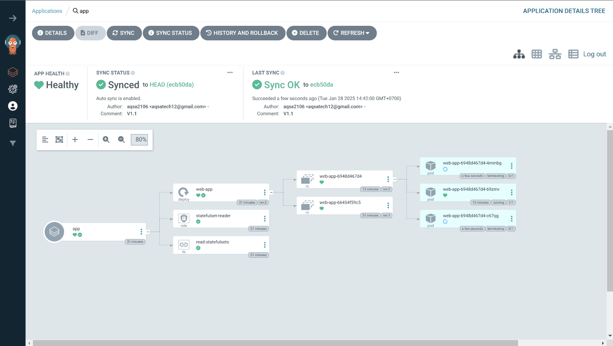

# Web App

This is a simple web application built with React. The application includes a home page, a dashboard, and a 404 not found page. It also includes a navigation bar for easy navigation between pages.



## Table of Contents

- [Overview](#overview)
- [Installation](#installation)
- [Usage](#usage)
- [Development](#development)
- [Build](#build)
- [Testing](#testing)
- [CI/CD Pipeline](#cicd-pipeline)
- [Docker](#docker)
- [Kubernetes Deployment](#kubernetes-deployment)
- [License](#license)

## Overview

This project demonstrates a simple web application built with React and deployed using ArgoCD on a Kubernetes cluster. The application includes basic routing and a navigation bar.

## Installation

To install the dependencies, run the following command:

```bash
npm install
```

## Usage

To start the development server, run the following command:

```bash
npm start
```

The application will be available at `http://localhost:3000`.

## Development

The project structure is as follows:

```
src/
  ├── components/
  │   └── Navbar.js
  ├── pages/
  │   ├── Dashboard.js
  │   ├── Home.js
  │   └── NotFound.js
  ├── App.js
  ├── index.css
public/
  └── index.html
package.json
```

## Build

To create an optimized production build, run the following command:

```bash
npm run build
```

## Testing

To run the tests, use the following command:

```bash
npm test
```

## CI/CD Pipeline

The project includes a GitHub Actions workflow for CI/CD. The workflow is defined in `.github/workflows/ci-cd.yml` and includes the following jobs:

- `build`: Checks out the code, sets up Node.js, installs dependencies, and builds the application.
- `docker`: Builds and pushes a Docker image to DockerHub.

## Docker

To build and run the Docker image locally, use the following commands:

```bash
docker build -t web-app .
docker run -p 3000:3000 web-app
```

## Kubernetes Deployment

To deploy the application on a Kubernetes cluster using ArgoCD, follow these steps:

1. Create a `Dockerfile` to build the Docker image:

    ```Dockerfile
    // filepath: /c:/Users/muhammad.aqsa/Documents/Belajar-Devops-Azur/Project-3/Nodejs/Dockerfile
    FROM node:16
    WORKDIR /app
    COPY package*.json ./
    RUN npm install
    COPY . .
    RUN npm run build
    RUN npm install -g serve
    CMD ["serve", "-s", "build"]
    ```

2. Create a Kubernetes deployment configuration:

    ```yaml
    // filepath: /c:/Users/muhammad.aqsa/Documents/Belajar-Devops-Azur/Project-3/Nodejs/k8s-deployment.yaml
    apiVersion: apps/v1
    kind: Deployment
    metadata:
      name: web-app
      labels:
        app: web-app
    spec:
      replicas: 1
      selector:
        matchLabels:
          app: web-app
      template:
        metadata:
          labels:
            app: web-app
        spec:
          containers:
          - name: web-app
            image: aqsa21/web-app:latest
            ports:
            - containerPort: 3000
            env:
            - name: PORT
              value: "3000"
    ```

3. Apply the Kubernetes deployment configuration:

    ```bash
    kubectl apply -f /c:/Users/muhammad.aqsa/Documents/Belajar-Devops-Azur/Project-3/Nodejs/k8s-deployment.yaml
    ```

4. Configure ArgoCD to deploy the application using the provided Kubernetes manifests.

## License

This project is licensed under the MIT License.
